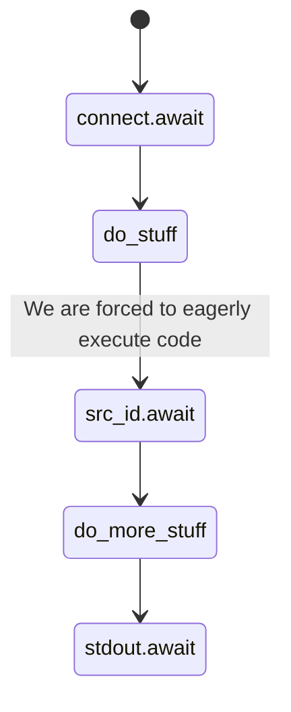
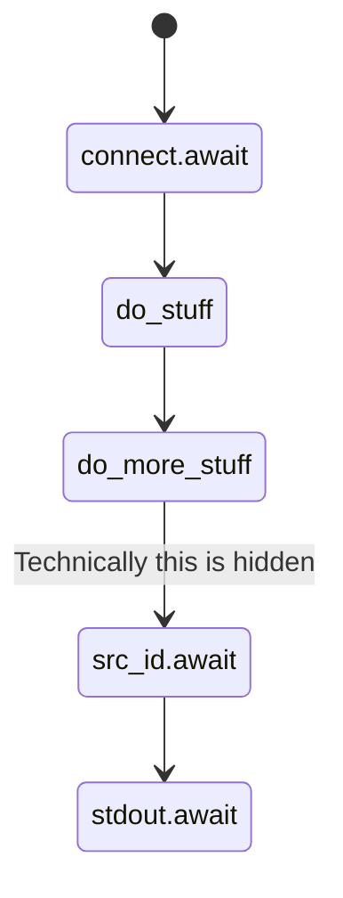

### Rust SDK Improvement

@kjuulh / @Hermansen4325

---

### Agenda

- Rust SDK enhancements; removing cruft
  
- Solving Rust build issues for fun and profit

---

### Rust SDK Enhancement

- Release: 0.3.0
    - Resolving long standing boiler plate issues
    - Aligning with the other sdks

---

### Cruft Removal 

```rust
async fn main() -> eyre::Result<()> {
     let client = dagger_sdk::connect().await?;

     let src = client.host().directory(".");
     
     let output = client
       .container()
       .from("rustlang/rust:nightly")
       // We've got to eagerly await
       .with_mounted_dir(".", src.id().await?)
       .with_exec(vec!["ls"])
       .stdout()
       .await?;
       
   println!("out: {output}");
}
```

---

### Cruft Removed!

```rust
async fn main() -> eyre::Result<()> {
     let client = dagger_sdk::connect().await?;

     let src = client.host().directory(".");
     
     let output = client
       .container()
       .from("rustlang/rust:nightly")
       .with_mounted_dir(".", src) // Now without .await?
       .with_exec(vec!["ls"])
       .stdout()
       .await?;
       
   println!("out: {output}");
}
```

---

### But why is this a big deal?

Count the awaits

<split even >




</split>

---

### But why is this a big deal?

- Creating lazy components is easier
- Plays to the dagger engine's strengths

---

### Solving rust builds for fun and profit

- Rust is very difficult to cache
	- Fetching dependencies
	- Compiling dependencies
	- Compiling application code
	- Is the same step (`cargo build`)

---

### Dagger to the rescue

- Demo!

### Next for Rust SDK

- Raw structs -> traits and functions
- Make version upgrades easier
- Migrating away from `eyre` to `thiserror`